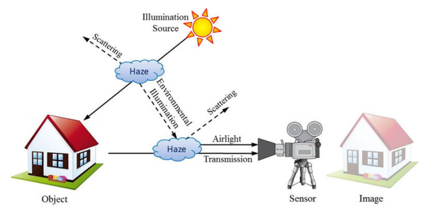
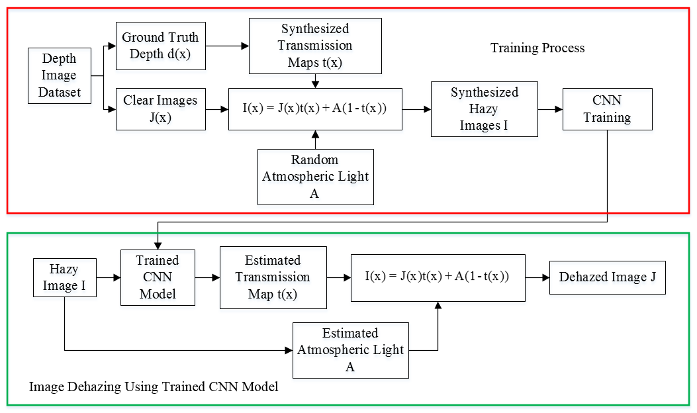
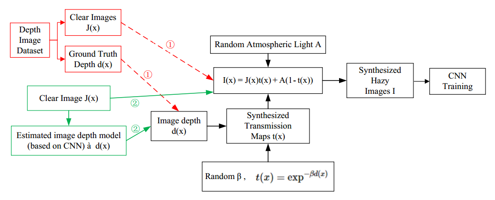
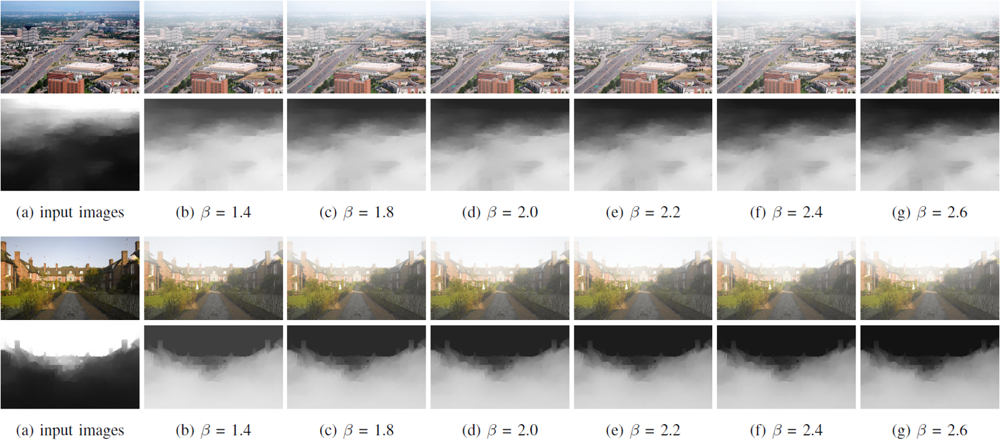
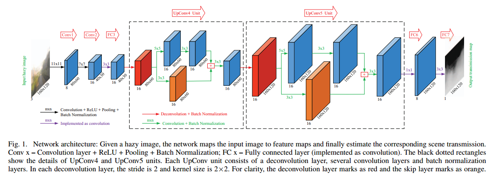

# 深度学习与图像去雾的简单介绍

## 一、有雾图像的成像模型
在整个计算机视觉和图形学领域中，有雾图像的形成原理所使用的常用的物理模型——大气散射模型（atmospheric scattering model）。

  
图片来源：Paper：DehazeNet: An End-to-End System for Single Image Haze Removal

**基本解释：** 在有雾的环境中，物体（或场景）反射出的光线由于雾气的干扰，光线强度受到衰减。光源（太阳）照射地面时，光线会有折射、散射，这些光线也会和物体的反射（或散射）光一同被相机所接收到。简而言之，相机接收到场景的光包含两层含义：

1. 来自于该物体（或场景）本身，这个部分的光强受到散射媒介的影响会有衰弱；

2. 来自大气中其他光源散射至相机（或人眼）的光强。

**模型抽象与简化：**
根据大气散射模型，有雾图像可以表示为：

      I(x) = J(x)t(x) + A(1−t(x))

其中 I(x) 是有雾图像，J(x)是物体（或场景）的原始辐射（radiance），A是全局大气光照，t(x)t(x) 被称作介质透射率（medium transmission）。

* I(x)表示有雾图像，RGB三个通道；
* J(x)是待恢复的图像，RGB三个通道；
* A是全局大气光值，也就是光源照射而反射或散射出的光；
* **t(x) 介质透射率，也就是场景的反射光线经过衰减后与衰减前的比率（从侧面反映了雾气的分布浓度），单个通道，且尺寸与I（x）相同；**
* J(x)t(x) 又称作直接衰减（direct attenuation）；

其中大气的全局光照应该是无向且均匀的，我们可以把 **A** 近似为一个于位置无关的常量，而透射率 **t(x)** 则是与位置相关的，因此是一个二维的透射图。
当大气介质是均匀的话，透射率则与物体（或场景）到相机的距离成反指数关系： 
 
        t(x) = exp(−βd(x))

其中 **d(x)** 是场景深度图（depth map）， **β** 是大气的散射系数。

## 二、问题解决（深度学习中的 CNN ）
因为上述的去雾简化模型中存在三个未知量，求解难度比较大。纵览从He Kaiming DCP方法到现在各式各样的去雾方法，问题解决的核心仍然是估计位置变量 **A, t(x)**, 而我个人所主要解决的是 **t(x)** 的估计， **A** 的估计使用了比较传统的方法。
### 0) 整体框架

### 1）训练数据集

**合成图的示意图如下：**

### 2）估计 t(x) 的end-to-end网络

### 3）去雾效果评估
**待更新**

## 三、深度学习与去雾方面的最新Paper

**CVPR 2018:  Densely Connected Pyramid Dehazing Network**

- [https://arxiv.org/pdf/1803.08396.pdf](https://arxiv.org/pdf/1803.08396.pdf)
- [Code Link](https://github.com/hezhangsprinter/DCPDN)

**CVPR 2018:  Gated Fusion Network for Single Image Dehazing**

- [Code Link](https://sites.google.com/site/renwenqi888/research/dehazing/gfn)

**ICCV 2017:  AOD-Net: All-in-One Dehazing Network**

- [Paper in: docs.google.com](https://docs.google.com/viewer?a=v&pid=sites&srcid=ZGVmYXVsdGRvbWFpbnxib3lpbGljc3xneDpjMjBjM2E3ZTAxZTM0NDU)
- [Code Link](https://github.com/Boyiliee/AOD-Net)
- [arxiv: https://arxiv.org/abs/1707.06543](https://arxiv.org/abs/1707.06543)

**AAAI 2018:  Towards Perceptual Image Dehazing by Physics-based Disentanglement and Adversarial Training**

- [http://www.umiacs.umd.edu/~xyang35/files/perceptual-image-dehazing.pdf](http://www.umiacs.umd.edu/~xyang35/files/perceptual-image-dehazing.pdf)

**Joint Transmission Map Estimation and Dehazing using Deep Networks**

- [https://arxiv.org/abs/1708.00581](https://arxiv.org/abs/1708.00581)

**End-to-End United Video Dehazing and Detection**

- [https://arxiv.org/abs/1709.03919](https://arxiv.org/abs/1709.03919)

**Image Dehazing using Bilinear Composition Loss Function**

- [https://arxiv.org/abs/1710.00279](https://arxiv.org/abs/1710.00279)  
- [Code Link](https://github.com/YangHuiAlice/BIlinear-Network-for-Dehazing)

**A Cascaded Convolutional Neural Network for Single Image Dehazing**

- [https://arxiv.org/abs/1803.07955](https://arxiv.org/abs/1803.07955)

**CANDY: Conditional Adversarial Networks based Fully End-to-End System for Single Image Haze Removal**  

- [https://arxiv.org/abs/1801.02892](https://arxiv.org/abs/1801.02892)

**Haze removal method for natural restoration of images with sky**

- [https://www.sciencedirect.com/science/article/pii/S0925231217314856](https://www.sciencedirect.com/science/article/pii/S0925231217314856)   
- [http://sci-hub.la/https://www.sciencedirect.com/science/article/pii/S0925231217314856](http://sci-hub.la/https://www.sciencedirect.com/science/article/pii/S0925231217314856)

**Fully Point-wise Convolutional Neural Network for Modeling Statistical Regularities in Natural Images**

- [https://arxiv.org/abs/1801.06302](https://arxiv.org/abs/1801.06302)

**C2MSNet: A Novel approach for single image haze removal**

- [https://arxiv.org/abs/1801.08406](https://arxiv.org/abs/1801.08406)

**Dalian University : Learning Aggregated Transmission Propagation Networks for Haze Removal and Beyond**

- [https://arxiv.org/abs/1711.06787](https://arxiv.org/abs/1711.06787)

**Dalian University : Two-Layer Gaussian Process Regression with Example Selection for Image Dehazing**

* [http://sci-hub.la/10.1109/TCSVT.2016.2592328](http://sci-hub.la/10.1109/TCSVT.2016.2592328)
* [Code Link](https://github.com/dlut-dimt/Two-Layer-GPR-Dehazing)

**Dalian University : Fast Example Searching for Input-adaptive Data-driven Dehazing with Gaussian Process Regression**

* [https://link.springer.com/content/pdf/10.1007/s00371-018-1485-y.pdf](https://link.springer.com/content/pdf/10.1007/s00371-018-1485-y.pdf)

**Dalian University: ICASSP 2018: Robust Haze Removal via Joint Deep Transmission and Scene Propagation**

**WHU-CVRS: Feed-Net: Fully End-to-End Dehazing**

**WHU-CVRS: Single Image Dehazing Using Deep Convolution Neural Networks**

* [Code Link](https://github.com/killsking/DehazingCNN)

**DeepDive: An End-to-End Dehazing Method Using Deep Learning**

* [http://ieeexplore.ieee.org/stamp/stamp.jsp?tp=&arnumber=8097344](http://ieeexplore.ieee.org/stamp/stamp.jsp?tp=&arnumber=8097344)

-------------------------------

### Atmospheric Light

* **ICCP 2014: Automatic Recovery of the Atmospheric Light in Hazy Images**   
[http://www.cs.huji.ac.il/~werman/Papers/iiii2013.pdf](http://www.cs.huji.ac.il/~werman/Papers/iiii2013.pdf)   
[[Project]](http://www.cs.huji.ac.il/~raananf/projects/atm_light/)  [[Code]](http://www.cs.huji.ac.il/~raananf/projects/atm_light/atm_light.rar)   

* **ICCP 2016:** Blind Dehazing Using Internal Patch Recurrence   
[www.wisdom.weizmann.ac.il/~ybahat/papers/blindDehazing_ICCP2016.pdf](www.wisdom.weizmann.ac.il/~ybahat/papers/blindDehazing_ICCP2016.pdf)   
[[Homepage]](http://www.wisdom.weizmann.ac.il/~ybahat/)  [[Code]](https://github.com/YuvalBahat/Dehazing-Airlight-estimation)   

* **ICCP 2017:** Air-Light Estimation Using Haze-Lines   
[https://pdfs.semanticscholar.org/156a/b46b8a1aa558d609ecab5ff3d69187a74cb9.pdf](https://pdfs.semanticscholar.org/156a/b46b8a1aa558d609ecab5ff3d69187a74cb9.pdf)   
[[Homepage]](http://www.eng.tau.ac.il/~berman/)  [[Code]](https://github.com/danaberman/non-local-dehazing)

* Single Image Dehazing through Improved Atmospheric Light Estimation   
 [https://arxiv.org/ftp/arxiv/papers/1510/1510.01018.pdf](https://arxiv.org/ftp/arxiv/papers/1510/1510.01018.pdf)

-------------------
### Some Dataset about Image Dehazing

* [Referenceless Prediction of Perceptual Fog Density and Perceptual Image Defogging](http://live.ece.utexas.edu/research/fog/fade_defade.html)

* [**ICIP 2017:** HAZERD: AN OUTDOOR SCENE DATASET AND BENCHMARK FOR SINGLE IMAGE DEHAZING](https://labsites.rochester.edu/gsharma/research/computer-vision/hazerd/)   
 [http://www2.ece.rochester.edu/~gsharma/papers/Zhang_ICIP2017_HazeRD.pdf](http://www2.ece.rochester.edu/~gsharma/papers/Zhang_ICIP2017_HazeRD.pdf)

* [Information about the AMOS Dataset](http://amos.cse.wustl.edu/dataset)   
The Archive of Many Outdoor Scenes (AMOS) dataset contains 1,128,087,180 images taken from 29945 webcams located around the world, the vast majority in the United States. Construction of AMOS began in March, 2006 and continues to this day. This dataset is unique in that it contains images from significantly more scenes than in previous work.

* RESIDE: A Benchmark for Single Image Dehazing   
[https://arxiv.org/abs/1712.04143](https://arxiv.org/abs/1712.04143)   
[[Project]](https://sites.google.com/site/boyilics/website-builder/reside)   

* Haze Visibility Enhancement: A Survey and Quantitative Benchmarking   
[https://arxiv.org/pdf/1607.06235.pdf](https://arxiv.org/pdf/1607.06235.pdf)  
* D-HAZY: A DATASET TO EVALUATE QUANTITATIVELY DEHAZING ALGORITHMS   
[http://www.meo.etc.upt.ro/AncutiProjectPages/D_Hazzy_ICIP2016/](http://www.meo.etc.upt.ro/AncutiProjectPages/D_Hazzy_ICIP2016/)

## 路漫漫其修远兮，吾将上下而求索 ......
