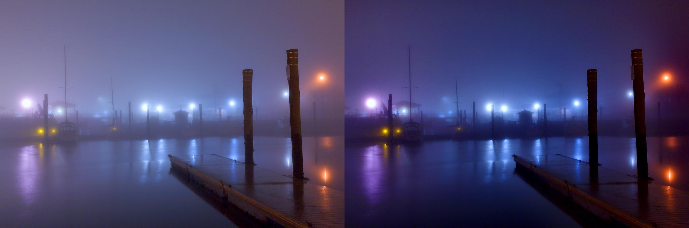

# DFCRN-for-Image-Dehazing   
------

Implementation code of the paper "Deep Fully Convolutional Regression Networks for Single Image Haze Removal."

[**Poseter Link**](https://1drv.ms/b/s!AsBw8rgL7PtzfmJ0ER48cROAtRo) and [**Supplementary_material Link**](https://1drv.ms/b/s!AsBw8rgL7Ptzfx2fzKtLSkFcR1c)

### 1. Prerequisites:

1. [Windows Caffe](https://github.com/microsoft/caffe) or Linux Caffe
2. MATLAB

### 2. Installation

Please install Caffe (Windows or Linux) fisrtly, and the installation for Windows OS is [here.](https://github.com/microsoft/caffe)  

### 3. Demo using pre-trained model

run the **dfcrn_demo.m** on your matlab

### 4. Dehazing results

### 5. Paper link and bibtex

* [paper link](http://ieeexplore.ieee.org/document/8305035/)
* 
        @inproceedings{zhao2017deep,
          title={Deep fully convolutional regression networks for single image haze removal},
          author={Zhao, Xi and Wang, Keyan and Li, Yunsong and Li, Jiaojiao},
          booktitle={Visual Communications and Image Processing (VCIP), 2017 IEEE},
          pages={1--4},
          year={2017},
          organization={IEEE}
        }

