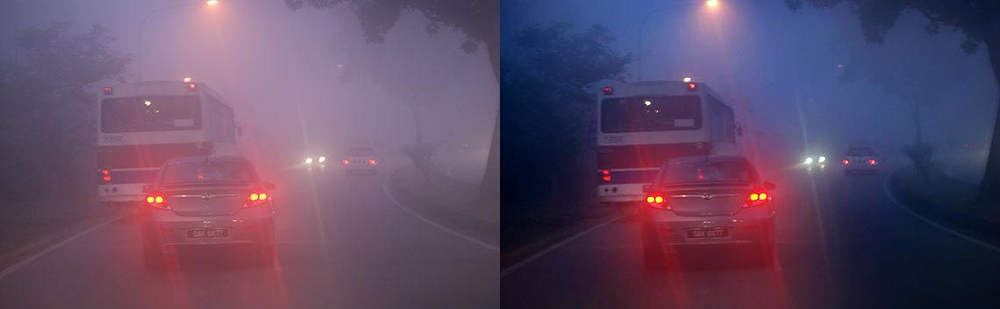

# DFCRN-for-Image-Dehazing

该项目是对自己的一篇会议论文 *[IEEE Visual Communications and Image Processing (VCIP 2017) Conference](http://www.vcip2017.org/home)*,  [**《Deep Fully Convolutional Regression Networks for Single Image Haze Removal》**](http://ieeexplore.ieee.org/document/8305035/) 的简单介绍。后续会更新更加详细的内容，相关代码也会陆续更新。2018/1/22 0:06:24 

### 0. 基本文件介绍
* ./Introduction.md ：**论文的简单介绍**

* ./VCIP2017\_poster\_A0\_ZhaoXi\_XDU.pdf  :论文相关的海报

* ./VCIP2017\_Supplementary\_material\_ZhaoXi\_XDU  :论文补充文件，去雾结果对比

* ./images/ : 插图文件
*
### 1. 去雾效果

以下图片大多从Google Images中找的，以及对应的去雾结果。

------------------
## 注：Introduction.md 中有较为详细的介绍。

    @inproceedings{zhao2017deep,
      title={Deep fully convolutional regression networks for single image haze removal},
      author={Zhao, Xi and Wang, Keyan and Li, Yunsong and Li, Jiaojiao},
      booktitle={Visual Communications and Image Processing (VCIP), 2017 IEEE},
      pages={1--4},
      year={2017},
      organization={IEEE}
    }

